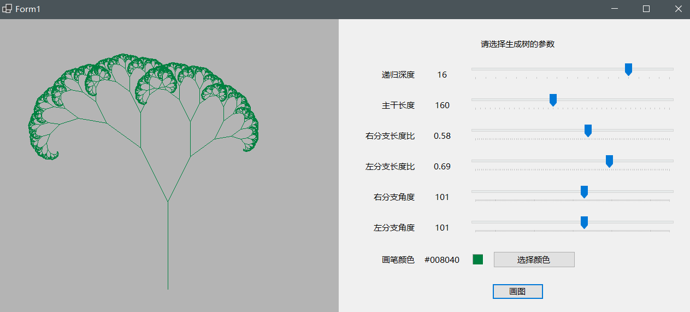

# Dot-Net-Homework

It's Liu Ruiyao's repository which contain the homework of 2022 dotnet class

## Homework1

A simple calculator both write in console and winform.

## Homework2

a few algorithm programs

## Homework3

Shape Factory

## Homework4

Generics, delegates & event

## Homework5

Order Service

## Homework6

XML & Unit Test

## Homework7

Winform drawing a tree

